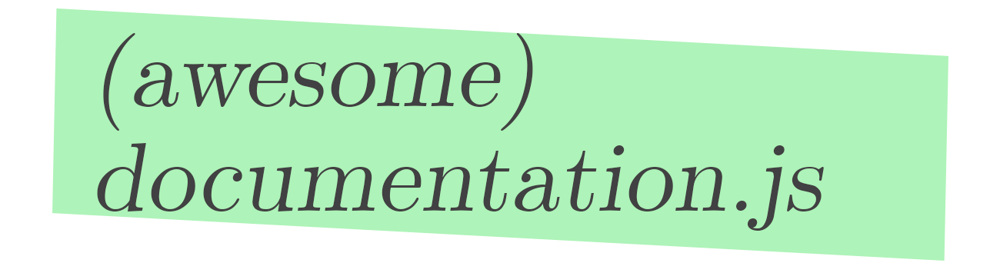

# awesome-documentation  

  

a list of websites using [documentation](https://github.com/documentationjs/documentation) to be awesome

* [node-mapnik](http://mapnik.org/documentation/node-mapnik/)
* [Mapbox GL JS](https://www.mapbox.com/mapbox-gl-js/api/)
* [Turf](http://turfjs.org/docs/)
* [Simple Statistics](http://simplestatistics.org/docs/)

## License

To the extent possible under law, [Tom MacWright](http://www.macwright.org) has waived all copyright and related or neighboring rights to this work.
